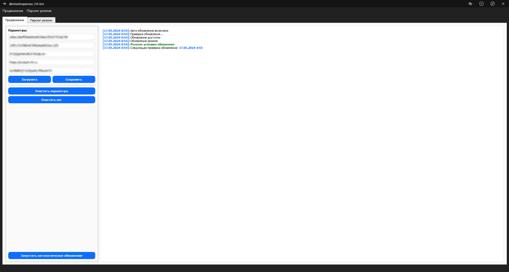
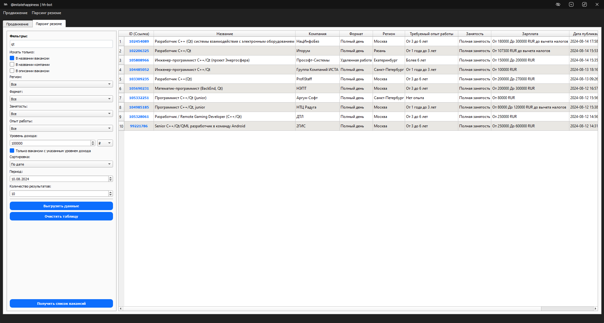

<p align="center">
  <a href="https://github.com/imitatehappiness/QtHeadHunterBot">
      
  </a>

# Auto HeadHunter Resume Update & Vacancies parser


>**Compiler:**  MinGW 5.8.0 64bit
>
>**Profile Qt:**  5.15.2 MinGW 64bit
>
>**System:**  Win11

## Навигация
- [Предисловие](#предисловие)
- [Описание](#описание)
- [Возможности](#возможности)
- [Сборка](#сборка)
- [Демонстрация](#демонстрация)


<a name="Предисловие"></a> 
# Предисловие

Выдача резюме на hh.ru, которую видит работодатель при поиске соискателей, постоянно пополняется новыми анкетами. В первую очередь отображаются те, что были созданы или обновлены недавно. То есть, если ваше резюме составлено давно и в последнее время вы не вносили в него никаких правок, на первые позиции выдачи не попадёт. Это снижает шансы на трудоустройство.

<a name="Описание"></a>
# Описание

Приложение на C++/Qt с графическим пользовательским интерфейсом, предназначенное для облегчения обновления вашего резюме и парсинга вакансий на HeadHunter. 

### Для правильной работы "обновления резюме" требуются следующие параметры:

+ **id resume:** Уникальный идентификатор вашего резюме на HeadHunter.
+ **hhtoken:** Токен API HeadHunter, необходимый для аутентификации.
+ **hhuid:** Идентификатор пользователя HeadHunter, связанный с вашей учетной записью.
+ **xsrf:** Межсайтовый запрос поддельного токена для безопасной связи с веб-сайтом HeadHunter.
+ **url:** Ваш региональный url HeadHunter. Например "https://moscow.hh.ru".

### Где найти необходимые параметры

+ **hhtoken, hhuid, xsrf** можно увидеть в веб-консоли после нажатия кнопки "Обновить дату". Выберите запрос на публикацию (*hh.ru/applicant/resumes/touch*) и перейдите на вкладку Cookies. В списке можно найти необходимые значения.

  <details>
  <summary>Как перейти</summary>
  <p align="left">
      
  </p>
  </details>

+ **resume id, url** можно найти в адресной строке на странице резюме.

<a name="Возможности"></a>
# Возможности

+ **Графический пользовательский интерфейс (GUI):** Удобный графический интерфейс обеспечивает легкую навигацию и взаимодействие с приложением.

<a name="обновление_резюме"></a>
### Обновление резюме:

+ **Фоновый режим:** Приложение работает в фоновом режиме, автоматически обновляя ваше резюме, не мешая другим вашим задачам. Для полного закрытия приложения необходимо выбрать соответствующий пункт в меню, доступный в системном трее.
+ **Управление настройками:** Приложение предоставляет возможность сохранять и загружать ваши параметры.

> :information_source: **Информация:**<br>
> Если обновление недоступно на момент запуска, приложение будет периодически (каждые 30 минут) отправлять запросы, пока резюме не обновится. После успешного обновления, резюме будет автоматически обновляться раз в 4 часа.

> ⚠️ **Предупреждение:**<br>
> При частых запросах к обновлению на сайте может появиться капча. В этом случае необходимо ввести капчу, а затем запустить автообновление.

<a name="парсинг_вакансий"></a>
### Парсинг вакансий:

+ **Выдача основной информации для первичного анализа:** 
	+ ID 
	+ URL 
	+ Название вакансии
	+ Название компании
	+ Требуемый опыт работы 
	+ Регион 
	+ Формат работы
	+ Занятость
	+ Зарплата
	+ Дата публикации
+ **Быстрый открытие:** Быстрое открытие вакансий на сайте HeadHunter путем нажатия на соотвествующий id в таблице.
+ **Фильтры:** Аналог фитрам hh.
+ **Простая сортировка результата:** Сортировка таблицы путем нажатия на хедер.
+ **Экспорт в XML:** Возможность экспортировать полученный результат в XML файл для дальнейшего анализа.

<a name="Сборка"></a>
# Сборка
 
Запустите windeployqt в командной строке, указав в качестве аргумента местоположение вашего проекта:
```
windeployqt --compiler-runtime C:\project_folder\HeadHunterBot.exe
```
Теперь HeadHunterBot.exe будет иметь все необходимые библиотеки dll и выполняться.

<a name="Демонстрация"></a>
# Демонстрация



### parse_vacancies.xml

```xml
<?xml version="1.0" encoding="UTF-8"?>
<Table>
    <Header>
        <Column index="1">ID (Ссылка)</Column>
        <Column index="2">Название</Column>
        <Column index="3">Компания</Column>
        <Column index="4">Формат</Column>
        <Column index="5">Регион</Column>
        <Column index="6">Требуемый опыт работы</Column>
        <Column index="7">Занятость</Column>
        <Column index="8">Зарплата</Column>
        <Column index="9">Дата публикации</Column>
    </Header>
    <Row>
        <Column index="1" field="URL">https://hh.ru/vacancy/102454089</Column>
        <Column index="2" field="Название">Разработчик C++ (Qt) системы взаимодействия с электронным оборудованием</Column>
        <Column index="3" field="Компания">НацИнфоБез</Column>
        <Column index="4" field="Формат">Полный день</Column>
        <Column index="5" field="Регион">Москва</Column>
        <Column index="6" field="Требуемый опыт работы">От 3 до 6 лет</Column>
        <Column index="7" field="Занятость">Полная занятость</Column>
        <Column index="8" field="Зарплата">От 180000 До 300000 RUR до вычета налогов</Column>
        <Column index="9" field="Дата публикации">2024-08-14 17:58:29 +0300</Column>
    </Row>
    <Row>
        <Column index="1" field="URL">https://hh.ru/vacancy/102206325</Column>
        <Column index="2" field="Название">Разработчик C++/Qt</Column>
        <Column index="3" field="Компания">Иторум</Column>
        <Column index="4" field="Формат">Полный день</Column>
        <Column index="5" field="Регион">Рязань</Column>
        <Column index="6" field="Требуемый опыт работы">От 1 года до 3 лет</Column>
        <Column index="7" field="Занятость">Полная занятость</Column>
        <Column index="8" field="Зарплата">От 107300 RUR до вычета налогов</Column>
        <Column index="9" field="Дата публикации">2024-08-14 15:53:57 +0300</Column>
    </Row>
    <Row>
        <Column index="1" field="URL">https://hh.ru/vacancy/105808966</Column>
        <Column index="2" field="Название">Инженер-программист С++/Qt (проект Энергосфера)</Column>
        <Column index="3" field="Компания">Прософт-Системы</Column>
        <Column index="4" field="Формат">Удаленная работа</Column>
        <Column index="5" field="Регион">Екатеринбург</Column>
        <Column index="6" field="Требуемый опыт работы">Более 6 лет</Column>
        <Column index="7" field="Занятость">Полная занятость</Column>
        <Column index="8" field="Зарплата">От 150000 До 200000 RUR</Column>
        <Column index="9" field="Дата публикации">2024-08-14 15:35:06 +0300</Column>
    </Row>
    <Row>
        <Column index="1" field="URL">https://hh.ru/vacancy/104485052</Column>
        <Column index="2" field="Название">Инженер-программист С++/Qt</Column>
        <Column index="3" field="Компания">Группа Компаний ИСТА</Column>
        <Column index="4" field="Формат">Полный день</Column>
        <Column index="5" field="Регион">Санкт-Петербург</Column>
        <Column index="6" field="Требуемый опыт работы">От 1 года до 3 лет</Column>
        <Column index="7" field="Занятость">Полная занятость</Column>
        <Column index="8" field="Зарплата">От 100000 RUR</Column>
        <Column index="9" field="Дата публикации">2024-08-13 18:16:36 +0300</Column>
    </Row>
    <Row>
        <Column index="1" field="URL">https://hh.ru/vacancy/103309235</Column>
        <Column index="2" field="Название">Разработчик С++(Qt)</Column>
        <Column index="3" field="Компания">ProfiStaff</Column>
        <Column index="4" field="Формат">Полный день</Column>
        <Column index="5" field="Регион">Москва</Column>
        <Column index="6" field="Требуемый опыт работы">От 3 до 6 лет</Column>
        <Column index="7" field="Занятость">Полная занятость</Column>
        <Column index="8" field="Зарплата">От 200000 До 270000 RUR</Column>
        <Column index="9" field="Дата публикации">2024-08-13 09:26:23 +0300</Column>
    </Row>
    <Row>
        <Column index="1" field="URL">https://hh.ru/vacancy/105690231</Column>
        <Column index="2" field="Название">Математик-программист (BackEnd, Qt)</Column>
        <Column index="3" field="Компания">НЭПТ</Column>
        <Column index="4" field="Формат">Полный день</Column>
        <Column index="5" field="Регион">Москва</Column>
        <Column index="6" field="Требуемый опыт работы">От 3 до 6 лет</Column>
        <Column index="7" field="Занятость">Полная занятость</Column>
        <Column index="8" field="Зарплата">От 200000 До 300000 RUR</Column>
        <Column index="9" field="Дата публикации">2024-08-12 16:57:15 +0300</Column>
    </Row>
    <Row>
        <Column index="1" field="URL">https://hh.ru/vacancy/105332251</Column>
        <Column index="2" field="Название">Программист С++/Qt (junior)</Column>
        <Column index="3" field="Компания">Аргун-Софт</Column>
        <Column index="4" field="Формат">Полный день</Column>
        <Column index="5" field="Регион">Санкт-Петербург</Column>
        <Column index="6" field="Требуемый опыт работы">Нет опыта</Column>
        <Column index="7" field="Занятость">Полная занятость</Column>
        <Column index="8" field="Зарплата">От 80000 RUR</Column>
        <Column index="9" field="Дата публикации">2024-08-12 15:56:31 +0300</Column>
    </Row>
    <Row>
        <Column index="1" field="URL">https://hh.ru/vacancy/104985185</Column>
        <Column index="2" field="Название">Программист С++/Qt, junior</Column>
        <Column index="3" field="Компания">НТЦ Радуга</Column>
        <Column index="4" field="Формат">Полный день</Column>
        <Column index="5" field="Регион">Москва</Column>
        <Column index="6" field="Требуемый опыт работы">От 1 года до 3 лет</Column>
        <Column index="7" field="Занятость">Полная занятость</Column>
        <Column index="8" field="Зарплата">От 80000 До 120000 RUR до вычета налогов</Column>
        <Column index="9" field="Дата публикации">2024-08-12 15:38:17 +0300</Column>
    </Row>
    <Row>
        <Column index="1" field="URL">https://hh.ru/vacancy/105328061</Column>
        <Column index="2" field="Название">Разработчик / Remote Gaming Developer (C++/Qt)</Column>
        <Column index="3" field="Компания">ДТЛ</Column>
        <Column index="4" field="Формат">Полный день</Column>
        <Column index="5" field="Регион">Москва</Column>
        <Column index="6" field="Требуемый опыт работы">От 3 до 6 лет</Column>
        <Column index="7" field="Занятость">Полная занятость</Column>
        <Column index="8" field="Зарплата">От 250000 RUR</Column>
        <Column index="9" field="Дата публикации">2024-08-12 14:56:32 +0300</Column>
    </Row>
    <Row>
        <Column index="1" field="URL">https://hh.ru/vacancy/99221786</Column>
        <Column index="2" field="Название">Senior C++/Qt/QML разработчик в команду Android</Column>
        <Column index="3" field="Компания">2ГИС</Column>
        <Column index="4" field="Формат">Полный день</Column>
        <Column index="5" field="Регион">Москва</Column>
        <Column index="6" field="Требуемый опыт работы">От 3 до 6 лет</Column>
        <Column index="7" field="Занятость">Полная занятость</Column>
        <Column index="8" field="Зарплата">От 250000 До 600000 RUR</Column>
        <Column index="9" field="Дата публикации">2024-08-12 14:31:10 +0300</Column>
    </Row>
</Table>
```
